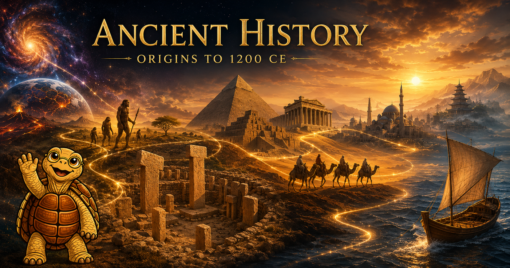

# Ancient History: Origins to 1200 CE

<figure markdown>
  { width="100%" }
</figure>

Welcome to **Ancient History: Origins to 1200 CE** — a textbook that takes you from the first microseconds of the universe to the eve of the Mongol conquests, and tries to make every step of that journey genuinely interesting.

## What this textbook is

This course surveys the full sweep of human experience from cosmic origins through the maturation of post-classical civilizations, organized around the UCLA "World History for Us All" **Big Era framework (Eras 1–5)** and three thematic axes — **Humans and the Environment**, **Humans and Other Humans**, and **Humans and Ideas** — that run through every chapter.

The accompanying [learning graph](learning-graph/index.md) is a directed graph of **297 concepts** that treats recent archaeological, paleoanthropological, and paleogenomic discoveries — Göbekli Tepe, Lomekwi 3, the Jebel Irhoud finds, ancient-DNA Yamnaya migration, the Sulawesi cave paintings, and more — as first-class nodes rather than footnotes to a 1990s narrative.

## Four superpowers you will gain

Studying ancient history is not just an exercise in memorizing names and dates. It is superpower acquisition:

1. **Critical thinking** — distinguishing claims from evidence and weighing competing interpretations.
2. **Systems thinking** — seeing how environment, trade, religion, and politics interact to produce cascading change.
3. **Positive skepticism** — the habit of asking "how do we know this?" before accepting or sharing a claim.
4. **Bias and misinformation detection** — recognizing point-of-view and selective framing in both ancient and modern sources.

The same analytical moves that work on cuneiform tablets work on your social-media feed. Chronos the Tortoise will remind you of this at key moments throughout the text.

## Chapters

| Era | Chapter | Topic |
|-----|---------|-------|
| — | [1. Foundations of Historical Thinking](chapters/01-foundations-of-historical-thinking/index.md) | Evidence, periodization, and the historian's toolkit |
| Big Era 1 | [2. Cosmic and Biological Origins](chapters/02-cosmic-and-biological-origins/index.md) | From the Big Bang to the emergence of life |
| Big Era 2 | [3. Hominin Evolution and the Genus *Homo*](chapters/03-hominin-evolution-and-genus-homo/index.md) | Seven million years of becoming human |
| Big Era 2 | [4. Paleolithic Migrations and Ice-Age Worlds](chapters/04-paleolithic-migrations-and-ice-age-worlds/index.md) | Out of Africa and across the globe |
| Big Era 2 | [5. Paleolithic Symbolic Culture and Other Hominins](chapters/05-paleolithic-symbolic-culture-and-other-hominins/index.md) | Cave art, cognition, and our vanished cousins |
| Big Era 3 | [6. The Neolithic Revolution](chapters/06-the-neolithic-revolution/index.md) | Agriculture, villages, and the invention of everything that followed |
| Big Era 3 | [7. Bronze Age Mesopotamia and Egypt](chapters/07-bronze-age-mesopotamia-and-egypt/index.md) | The first cities, writing, and riverine civilizations |
| Big Era 3–4 | [8. Bronze Age Asia, the Aegean, and Collapse](chapters/08-bronze-age-asia-aegean-and-collapse/index.md) | International systems and the Late Bronze Age crash |
| Big Era 4 | [9. The Iron Age and the Greco-Roman World](chapters/09-iron-age-and-greco-roman-world/index.md) | Polis, republic, and empire |
| Big Era 4 | [10. The Axial Age and World Religions](chapters/10-the-axial-age-and-world-religions/index.md) | When the world's great ethical traditions were born |
| Big Era 4 | [11. Classical Empires of Asia](chapters/11-classical-empires-of-asia/index.md) | Han China, Maurya and Gupta India, Silk Road |
| Big Era 5 | [12. Late Antiquity and Byzantium](chapters/12-late-antiquity-and-byzantium/index.md) | Rome transforms, Constantinople endures |
| Big Era 5 | [13. The Rise of Islam](chapters/13-the-rise-of-islam/index.md) | Revelation, conquest, and the Abbasid Golden Age |
| Big Era 5 | [14. Tang–Song China and Carolingian Europe](chapters/14-tang-song-china-and-carolingian-europe/index.md) | Two renaissance moments, half a world apart |
| Big Era 5 | [15. Afro-Eurasian Networks](chapters/15-afro-eurasian-networks/index.md) | Trans-Saharan gold, Indian Ocean dhows, Silk Road caravans |
| Bridge | [16. Pre-Columbian Americas and the Eve of Integration](chapters/16-pre-columbian-americas-and-eve-of-integration/index.md) | Cahokia, Maya, Chaco, and the world circa 1200 CE |

## Also available

- **[Course Description](course-description.md)** — full syllabus with learning outcomes organized by Bloom's taxonomy.
- **[Learning Graph](learning-graph/index.md)** — the 297-concept directed graph with quality metrics and taxonomy distribution.
- **[Learning Graph Viewer](sims/graph-viewer/index.md)** — interactive, searchable, filterable graph exploration.
- **[Glossary](glossary.md)** — key terms and definitions.

## How to navigate

Use the left sidebar to browse by chapter, or jump straight to the [interactive learning graph viewer](sims/graph-viewer/main.html) to explore concept dependencies visually. Each chapter opens with a welcome from Chronos, your guide for the long view.
